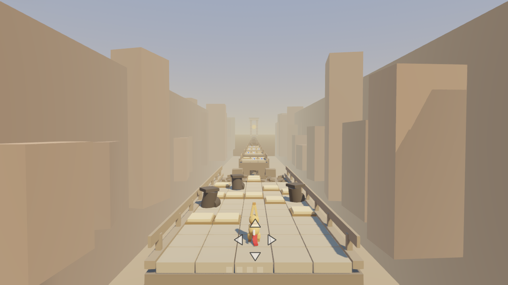
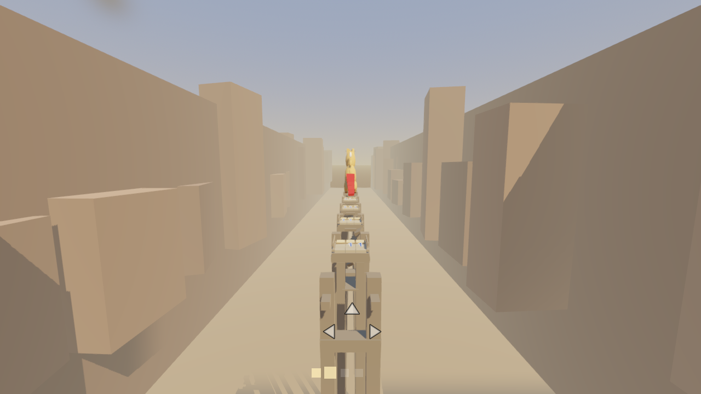
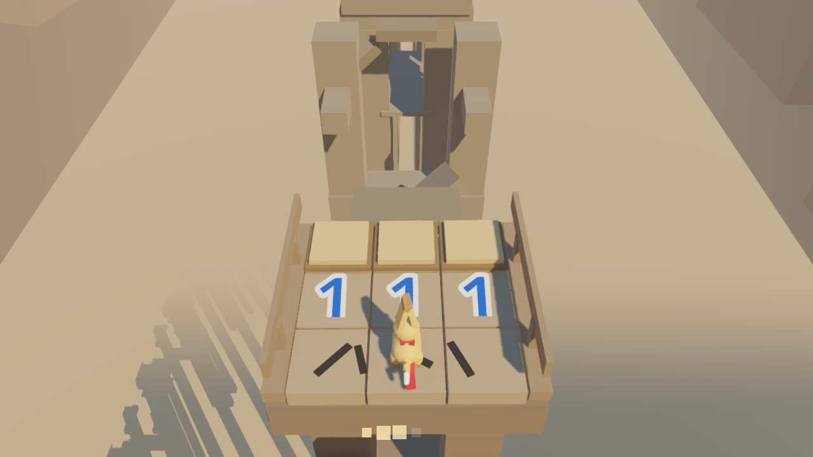
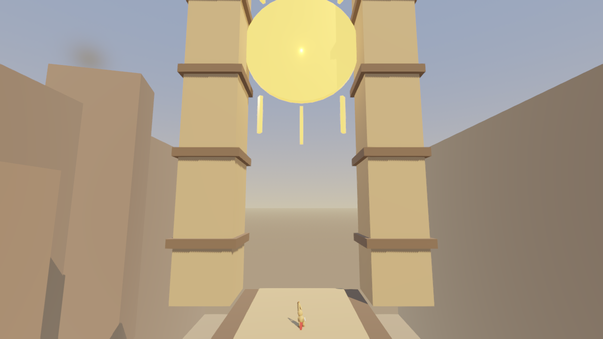

# MineBeat Rush — Stage 1: Desert Bridge

GDD v1.0 (`MineBeat_Rush_GDD_v1.0.md`) 를 정본으로 구현한 Godot 4.7 프로젝트.

> 무너지는 사막의 초장대 석교 위에서, 지뢰찾기 숫자로 탈출용 지뢰를 찾아 자유 대시로 도달하고,
> GO 순간 그 지뢰를 일부러 밟아 폭발 추진력으로 끊어진 다리를 건넌다.

| | |
| --- | --- |
|  |  |
| 오프닝 — 목적지 Sun Gate가 처음부터 보인다 | 첫 지뢰 사고 — 죽지 않고 날아간다. 뒤 방향 표식이 깨진다 |
|  |  |
| 3열 기본 퍼즐 — `1 1 1` 이면 가운데가 지뢰 | Sun Gate 도착 |

---

## 실행

```bash
S:\GameDev\MineBeatRush\게임실행.bat
```

또는 직접:

```bash
S:\GameDev\Godot\Godot_v4.7-stable_win64.exe --path S:\GameDev\MineBeatRush
```

에디터로 열기: `에디터열기.bat`

### 조작 (GDD 7.1 [LOCK])

| 입력 | 행동 |
| --- | --- |
| `←` / `A` | 화면 기준 왼쪽 한 칸 대시 |
| `↑` / `W` | 앞으로 한 칸 대시 |
| `→` / `D` | 화면 기준 오른쪽 한 칸 대시 |
| `↓` / `S` | 뒤로 — **Act 0 자유이동 구간에서만.** 첫 폭발 이후 영구 삭제 |
| `Esc` | 옵션 (흔들림 / 힌트 / 볼륨 / 키 재설정) |
| `R` | 스테이지 재시작 — 옵션 화면 또는 결과 화면에서만 |
| `F3` | 개발용 디버그 오버레이 |

대시는 **박자와 무관하게 언제든** 입력된다. 리듬은 다리의 수명을 정할 뿐 입력을 막지 않는다.

---

## 코어 루프

```
착지 GO → 3 손상1 → 2 손상2 → 1 손상3 → GO 섹터 전체 붕괴
          └ 이 4박 안에 숫자를 읽고 탈출 지뢰까지 실제로 이동한다

GO에 지뢰 위      → BOOM → 발사 GO → 3 급상승 → 2 최고점 → 1 중력가속 → GO 착지
GO에 지뢰 미도달  → 섹터와 함께 추락 → 빨간 머플러 전개 → Scarf Glide → 같은 박에 다음 구간 도착
```

즉사는 없다. 실패해도 다음 섹터로 진행하며, 판정(PERFECT/GOOD/BAD)은 자세·음향·VFX만 바꾸고
이동거리·체공시간·착지 시각은 절대 바꾸지 않는다.

---

## 스테이지 1 구성

| 항목 | 값 |
| --- | --- |
| 섹터 수 | 34 (Learn 6 / Master 8 / Escalate 12 / Remix 6 / Finale 2) |
| 길이 | 약 2분 59초 + 도착 연출 |
| BPM 곡선 | 92 → 98 → 104 → 110 → 116 → 122 |
| 다리 총 길이 | 약 1,354 m |
| 격자 폭 | 3열 → 5열 |

모든 섹터는 기동 시 자동 검증된다 (§27.1). 하나라도 실패하면 게임이 뜨지 않는다.

---

## 아키텍처 (GDD 25)

| 모듈 | 파일 | 책임 |
| --- | --- | --- |
| GameDirector | `scripts/gameplay/GameDirector.gd` | 스테이지 상태기계, Act 전환, GO 판정 |
| BeatConductor | `scripts/autoload/BeatConductor.gd` | **오디오 재생위치 = 마스터 클럭.** beat/phase 계산 |
| BridgeManager | `scripts/gameplay/BridgeManager.gd` | 하나의 장대교를 섹터 단위로 스트리밍 |
| BridgeSector | `scripts/gameplay/BridgeSector.gd` | 손상 0/1/2/3/붕괴, 타일·장애물·지뢰 배치 |
| MineGrid | `scripts/core/MineGrid.gd` | **순수 지뢰찾기 데이터.** 숫자 생성, 유일해/도달성 검증 |
| PlayerMotor | `scripts/gameplay/PlayerMotor.gd` | 자유 타일 대시. BeatConductor를 참조하지 않음 |
| LaunchController | `scripts/gameplay/LaunchController.gd` | 탄도 궤적 `sample(beat)` 순수 함수, Scarf Glide |
| CameraDirector | `scripts/presentation/CameraDirector.gd` | 시점 전환. yaw/roll 영구 0 |
| CharacterAnimator | `scripts/presentation/CharacterAnimator.gd` | 포즈(authored) + 귀/머플러(procedural) 분리 |
| VFXDirector | `scripts/presentation/VFXDirector.gd` | 균열·먼지·폭발·파편 |
| AudioDirector | `scripts/autoload/AudioDirector.gd` | 4스템 동시 재생 + Act별 믹스, SFX |

분리 원칙이 지켜졌는지는 `docs/LOCK_CHECKLIST.md` 참고.

---

## 오디오

`assets/audio/` 의 음원은 전부 절차적으로 생성된 것이다. 다시 만들려면:

```bash
python S:\GameDev\MineBeatRush\tools\gen_audio.py
```

`assets/data/stage1_tempo.json` 의 템포맵을 읽어 4개 스템(drums/bass/lead/atmos)을 하나의
연속 테이크로 렌더한다. 마디 다운비트가 항상 GO 박에 정확히 오도록 만들어져 있으며,
게임은 이 중 한 스템의 재생 위치를 마스터 클럭으로 쓴다.

---

## 테스트

```bash
S:\GameDev\MineBeatRush\테스트.bat
```

또는:

```bash
S:\GameDev\Godot\Godot_v4.7-stable_win64_console.exe --headless --path S:\GameDev\MineBeatRush --script res://tests/run_tests.gd
```

54개 어서션. 지뢰찾기 숫자 법칙, 3열/5열 패턴, 2지뢰 구성, 50/50 거부, 이동 규칙,
장애물 우회, 템포맵 역함수, 탄도 궤적(정점 고정 / 중력 가속 / 판정 무관), 34섹터 체인 검증.

---

## 개발용 실행 인자

일반 플레이에서는 절대 닿지 않는 경로다.

```bash
godot --path . -- --sector 18            # 18번 섹터부터 바로 시작
godot --path . -- --sector 18 --auto     # 자동 플레이(정답까지 대시, PERFECT 타이밍)
godot --path . -- --shots <dir> --shot-from 300 --shot-count 8 --shot-step 1.5
```

`--auto` 는 레벨 검증기와 같은 MineGrid로 답을 풀고 `PlayerMotor.inject()` 로 입력한다.
즉 실제 키 입력과 완전히 같은 경로를 지나므로 루프를 우회하지 않는다.

---

## 아직 하지 않은 것

GDD가 [TEST] 또는 후속 마일스톤으로 표시한 항목들:

- Blender 캐릭터 리그 — 현재 캐릭터는 프로시저럴 그레이박스 (GDD 32.3 지침에 따름)
- 상부/하부 분기 루트 (§10.2 [TEST]) — 하부 유지보수 통로는 지오메트리로만 존재
- 부분 단서 파손, 기울어진 갑판, 큰 폭발 지뢰 (§19 [TEST])
- Remix 카운트 변형 (§19 [TEST])
- Stage 2 이후, 랭크 저장, 리플레이 (§29 Milestone D)
